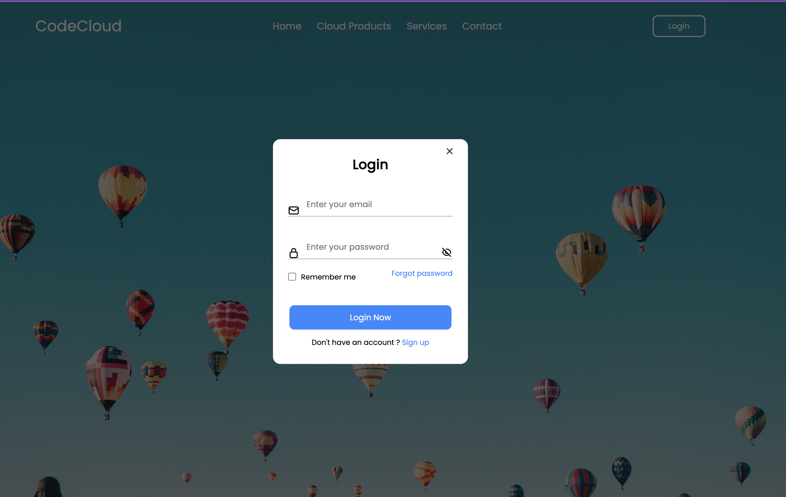

# Login Form Project

This project consists of a login and registration form built using HTML, CSS, and JavaScript. It provides a simple interface for users to enter their credentials and either log in or sign up for an account.

## Installation

1. Clone the repository or download the project files.
2. Open the `index.html` file in a web browser.

## Usage

The login form allows users to enter their email and password to log in. It also includes an option for remembering the login and a link to reset the password if needed. Users can click the "Login" button to submit the form and proceed.

The signup form allows new users to create an account. It requires an email address, password, and password confirmation. After filling in the required information, users can click the "Signup" button to create their account.

## Dependencies

- [Unicons](https://iconscout.com/unicons) - The project uses the Unicons library for the eye icons used to show/hide the password input.

## File Structure

The project files are structured as follows:

- `index.html`: The main HTML file containing the login and signup forms.
- `style/main.css`: The CSS file for styling the login form and layout.
- `script/app.js`: The JavaScript file containing the logic for form interactions.

## Contributing

Contributions to this project are welcome. If you find any issues or would like to suggest improvements, please feel free to submit a pull request.

## License

This project is licensed under the [MIT License](LICENSE).

